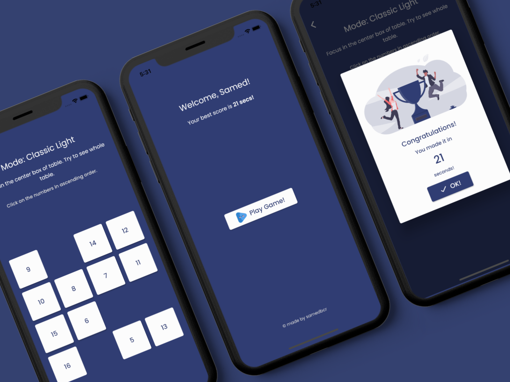

# Schulte Table App

Schulte Table Game – Mobile Application that made with Flutter. I have tried to make Classic Light game in [this site](https://schulte-table.com/).

### How to use?

You can customize this app via change some values into source code. In ```lib/view/home_view.dart``` file, you can modify ```level```, ```startNumber``` and ```incrementCount``` values in order to increase or decrease difficulty.

**Using Packages:**

- flutter_svg
- cupertino_icons

### Photos
